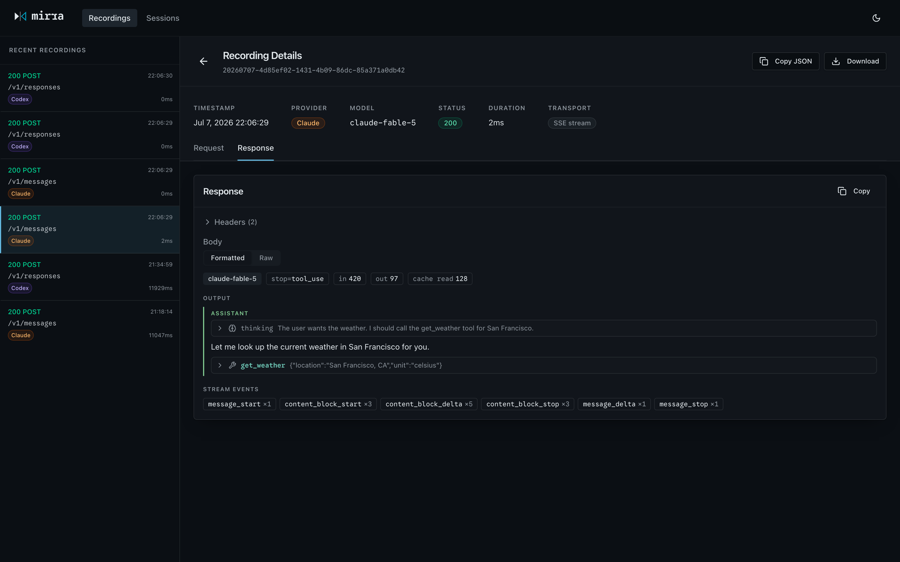
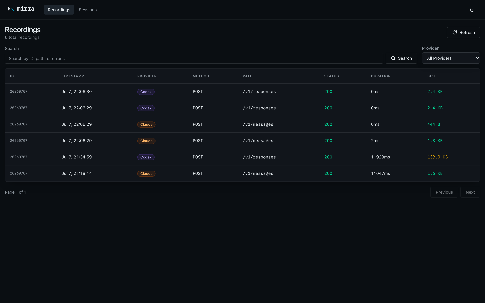

<p align="center">
  
</p>

<h1 align="center">mirra</h1>

<p align="center"><strong>M</strong>onitoring &amp; <strong>I</strong>nspection <strong>R</strong>ecording <strong>R</strong>elay <strong>A</strong>rchive</p>



A transparent HTTP proxy for Large Language Model APIs that records all request/response traffic without modifying it.

MIRRA acts as a pass-through intermediary for inspection, auditing, and analysis of LLM API usage. Currently supports Claude (Anthropic), OpenAI, Codex (ChatGPT subscription), and Google Gemini APIs.

## Quick Installation

Install directly with Go:
```bash
go install github.com/jpoz/mirra@latest
```

Or build from source:
```bash
git clone https://github.com/jpoz/mirra.git
cd mirra
go build -o mirra .
```

Then start the proxy:
```bash
mirra
```

Bare `mirra` is shorthand for `mirra start`. Add `--attach claude,codex` to also point new Claude Code / Codex sessions at the proxy.

## Features

- **Transparent proxying**: Requests and responses pass through unmodified
- **Multi-provider support**: Claude (Anthropic), OpenAI, Codex (ChatGPT subscription), and Google Gemini APIs
- **Web UI**: Browse traffic in the browser — conversations, system prompts, tool calls, thinking blocks, and token usage rendered readably for Claude and Codex, with a JSON/raw fallback for everything
- **Session grouping**: Recordings are grouped into agent sessions by trace/session metadata and browsable as one conversation flow
- **Streaming support**: Handles both regular and Server-Sent Events (SSE) streaming responses; recorded streams are reconstructed into the final message in the UI
- **Asynchronous recording**: Records traffic without adding latency to API calls
- **Compression handling**: Decompresses gzip- and zstd-encoded payloads so recordings stay readable
- **Export & analysis**: Built-in commands to export and analyze recorded traffic
- **Advanced viewing**: Partial UUID matching, automatic redaction of sensitive data, SSE formatting
- **Structured logging**: Multiple output formats (pretty, JSON, plain) with color-coded request logs

## Installation

### Prerequisites

- Go 1.21 or later

### Build from source

```bash
go build -o mirra .
```

## Usage

### Start the proxy server

```bash
./mirra start
```

By default, the proxy listens on port `4567`. You can specify a custom port:

```bash
./mirra start --port 8080
```

Or provide a configuration file:

```bash
./mirra start --config ./config.json
```

### Browse traffic in the web UI

The proxy serves a web UI on the same port — open [http://localhost:4567](http://localhost:4567) while `mirra start` is running.



- **Recordings** lists every captured request with provider, status, duration, and size, with search and provider filters.
- Opening a recording shows the request and response as **formatted views**: Claude and Codex traffic renders as a conversation — system prompt, tool definitions, messages, tool calls and results, thinking blocks, and token usage — and recorded SSE streams are reconstructed into the final message with a per-event summary. Every body also has JSON and raw views one toggle away.
- **Sessions** groups recordings into agent sessions (by trace or session metadata), so a whole Claude Code or Codex run can be stepped through in order with the arrow keys.

### Run Claude Code through MIRRA

```bash
./mirra claude
```

Launches the `claude` CLI with its API traffic routed through MIRRA, with the UI at the usual place: `http://localhost:4567` (the configured port). A MIRRA already listening there — whether from `mirra start` or another `mirra claude` — is reused; otherwise one starts in-process and lives until this session and any other `mirra claude` sessions riding on it finish. Everything after `claude` is passed through to the CLI:

```bash
./mirra claude --resume
./mirra claude -p "explain this repo"
```

Unlike `--attach`, this touches no config files: the proxy address is injected only as an environment variable (`ANTHROPIC_BASE_URL`) on the one claude process it spawns, so other claude sessions are unaffected and there is nothing to restore afterwards. While claude owns the terminal, all proxy output goes to `~/.mirra/mirra.log`.

### Auto-attach Claude Code and Codex

```bash
./mirra start --attach claude,codex
```

While an attached proxy is running, every **new** `claude` or `codex` session routes its API traffic through MIRRA; already-running sessions are unaffected. On shutdown (Ctrl+C / SIGTERM) the original configs are restored.

How it works:

- **Claude Code**: merges `env.ANTHROPIC_BASE_URL` into `~/.claude/settings.json` (respects `CLAUDE_CONFIG_DIR`). Works with both API-key and subscription auth.
- **Codex**: prepends a marker-delimited `openai_base_url` override to `~/.codex/config.toml` (respects `CODEX_HOME`). Works with both API-key and ChatGPT-subscription auth — subscription traffic is detected per-request via the `ChatGPT-Account-ID` header and forwarded to `chatgpt.com/backend-api/codex`, recorded under the `chatgpt` provider. Codex's websocket transport is tunneled transparently; each connection becomes one recording holding every message in both directions.

Only the specific keys MIRRA owns are touched, and what was changed is journaled to `~/.mirra/attach.json` before the proxy starts serving. If an attached run dies without cleaning up (crash, `kill -9`), the next `mirra start --attach` repairs it automatically, or run:

```bash
./mirra detach
```

Notes:

- A tool whose config directory doesn't exist is skipped with a log line.
- If `config.toml` already sets `openai_base_url`, MIRRA refuses to manage codex and says so rather than fighting over the key.
- A websocket recording is written when the connection closes, so a long codex session shows up once it ends.

### Configure your API client

Point your LLM API client to the MIRRA proxy instead of the upstream API:

**Claude:**
```bash
# Instead of: https://api.anthropic.com
# Use: http://localhost:4567
```

**OpenAI:**
```bash
# Instead of: https://api.openai.com
# Use: http://localhost:4567
```

**Gemini:**
```bash
# Instead of: https://generativelanguage.googleapis.com
# Use: http://localhost:4567
```

Keep your API keys unchanged - MIRRA forwards them to the upstream APIs.

### Export recordings

Export all recordings:

```bash
./mirra export --output traffic.jsonl
```

Export with filters:

```bash
./mirra export --from 2025-01-01 --to 2025-01-31 --provider claude --output claude-jan.jsonl
```

Options:
- `--from` - Start date (YYYY-MM-DD)
- `--to` - End date (YYYY-MM-DD)
- `--provider` - Filter by provider (claude, openai, gemini, or chatgpt)
- `--output` - Output file path (default: export.jsonl)
- `--recordings` - Path to recordings directory (default: ./recordings)

### View statistics

```bash
./mirra stats
```

Filter by date range or provider:

```bash
./mirra stats --from 2025-01-01 --provider openai
```

Options:
- `--from` - Start date (YYYY-MM-DD)
- `--provider` - Filter by provider (claude, openai, gemini, or chatgpt)
- `--recordings` - Path to recordings directory (default: ./recordings)

### View a specific recording

View a recording by ID (supports partial UUID matching):

```bash
./mirra view a1b2c3d4
```

View the most recent recording:

```bash
./mirra view
```

Features:
- Partial UUID matching - just provide the first few characters
- Automatically redacts sensitive data (API keys, tokens)
- Decompresses gzip-compressed responses
- Formats streaming SSE responses for readability
- Pretty-prints JSON

Options:
- `<recording-id>` - Full or partial UUID (optional, defaults to last recording)
- `--recordings` - Path to recordings directory (default: ./recordings)

## Configuration

Configuration can be provided via a JSON file or environment variables.

### Configuration file (config.json)

```json
{
  "port": 4567,
  "recording": {
    "enabled": true,
    "storage": "file",
    "path": "./recordings",
    "format": "jsonl"
  },
  "logging": {
    "format": "pretty",
    "level": "info"
  },
  "providers": {
    "claude": {
      "upstream_url": "https://api.anthropic.com"
    },
    "openai": {
      "upstream_url": "https://api.openai.com"
    },
    "gemini": {
      "upstream_url": "https://generativelanguage.googleapis.com"
    },
    "chatgpt": {
      "upstream_url": "https://chatgpt.com/backend-api/codex"
    }
  }
}
```

### Environment variables

Environment variables override config file values:

- `MIRRA_PORT` - Server port (default: 4567)
- `MIRRA_RECORDING_ENABLED` - Enable/disable recording (default: true)
- `MIRRA_RECORDING_PATH` - Directory for recording files (default: ./recordings)
- `MIRRA_CLAUDE_UPSTREAM` - Claude API upstream URL
- `MIRRA_OPENAI_UPSTREAM` - OpenAI API upstream URL
- `MIRRA_GEMINI_UPSTREAM` - Gemini API upstream URL
- `MIRRA_CHATGPT_UPSTREAM` - ChatGPT backend upstream URL (codex subscription traffic)

### Logging

MIRRA supports three logging formats via the `logging.format` configuration:

- **pretty** (default): Human-readable with color-coded log levels and request symbols
- **json**: Structured JSON output for log aggregation systems
- **plain**: Standard text format with key=value pairs

Log levels: `debug`, `info`, `warn`, `error`

## Recording Format

Recordings are stored as JSONL files (one JSON object per line) with the naming pattern `recordings-YYYY-MM-DD.jsonl`.

Each recording includes:

```json
{
  "id": "uuid-v4",
  "timestamp": "2025-01-15T10:30:00Z",
  "provider": "claude|openai|gemini|chatgpt",
  "request": {
    "method": "POST",
    "path": "/v1/messages",
    "query": "key=value",
    "headers": {
      "content-type": ["application/json"]
    },
    "body": {}
  },
  "response": {
    "status": 200,
    "headers": {
      "content-type": ["application/json"]
    },
    "body": {},
    "streaming": false
  },
  "timing": {
    "started_at": "2025-01-15T10:30:00.123Z",
    "completed_at": "2025-01-15T10:30:02.456Z",
    "duration_ms": 2333
  }
}
```

**Note**: Compressed payloads (gzip, zstd) are decompressed before recording so bodies stay readable. A body that still isn't valid text (e.g. binary content) is stored base64-encoded with a `base64:` prefix.

## Supported API Endpoints

### Claude (Anthropic)
- `/v1/messages` - Messages API (streaming and non-streaming)
- `/v1/complete` - Legacy completion API

### OpenAI
- `/v1/chat/completions` - Chat completions (streaming and non-streaming)
- `/v1/completions` - Legacy completions
- `/v1/embeddings` - Embeddings
- `/v1/models` - List models
- `/v1/models/:id` - Retrieve model
- `/v1/responses` - Responses API

### Gemini (Google)
All Gemini API endpoints across versions (v1, v1beta, v1alpha):
- Model operations (generateContent, streamGenerateContent, embedContent, countTokens, etc.)
- File operations (upload, list, get, delete)
- Cached contents management
- Corpora and semantic retrieval (documents, chunks)
- Tuned models (operations, permissions)
- Batch operations

Example endpoints:
- `/v1/models/gemini-pro:generateContent`
- `/v1beta/models/gemini-2.5-pro:streamGenerateContent`
- `/v1/files`
- `/upload/v1/files`

## Examples

### Using with curl

**OpenAI:**
```bash
# Start the proxy
./mirra start

# Make a request through the proxy
curl -X POST http://localhost:4567/v1/chat/completions \
  -H "Content-Type: application/json" \
  -H "Authorization: Bearer YOUR_OPENAI_API_KEY" \
  -d '{
    "model": "gpt-4",
    "messages": [{"role": "user", "content": "Hello!"}]
  }'
```

**Claude:**
```bash
curl -X POST http://localhost:4567/v1/messages \
  -H "Content-Type: application/json" \
  -H "x-api-key: YOUR_ANTHROPIC_API_KEY" \
  -H "anthropic-version: 2023-06-01" \
  -d '{
    "model": "claude-3-5-sonnet-20241022",
    "messages": [{"role": "user", "content": "Hello!"}],
    "max_tokens": 1024
  }'
```

**Gemini:**
```bash
curl -X POST "http://localhost:4567/v1/models/gemini-2.5-pro:generateContent?key=YOUR_GEMINI_API_KEY" \
  -H "Content-Type: application/json" \
  -d '{
    "contents": [{
      "parts": [{"text": "Hello!"}]
    }]
  }'
```

The request and response will be automatically recorded in the `./recordings` directory.

## Performance

MIRRA is designed for minimal overhead:
- Target latency: < 1ms additional overhead
- Streaming responses pass through in real-time
- Recording happens asynchronously without blocking requests

## Development

### Running Tests

```bash
# Run all tests
make test

# Run tests with verbose output
make test-verbose

# Run tests with race detector
make test-race

# Run tests with coverage
make test-coverage

# Generate HTML coverage report
make coverage-html
```

### Code Quality

```bash
# Format code
make fmt

# Run linters
make lint

# Run go vet
make vet
```

### Git Workflow

Install git hooks for automatic code quality checks:

```bash
make install-hooks
```

This installs:
- **pre-commit hook**: Runs `gofmt` and `go vet` on staged files
- **pre-push hook**: Runs the full test suite before pushing

To skip hooks temporarily:
```bash
git commit --no-verify
git push --no-verify
```

### Contributing

See [CONTRIBUTING.md](CONTRIBUTING.md) for development guidelines and workflow.

## License

See LICENSE file for details.
